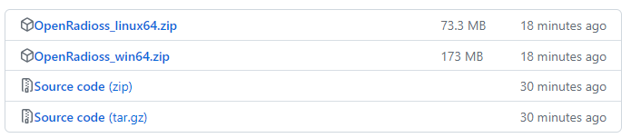

# Radioss Relases

OpenRadioss builds are available in the [Releases area on GitHub](https://github.com/OpenRadioss/OpenRadioss/releases).

6 builds are available : there are the last build of the current day and the last build of the 5 last days.

The build  package contains OpenRadioss binaries for Linux and Windows:

## The Linux builds

Linux builds can be executed on:

* Linux CentOS 7.9 or higher
* RHEL 7.9 or higher
* Ubuntu 20,.x or higher...

       ├── COPYRIGHT.md
       ├── exec
       │   ├── starter_linux64_gf
       │   ├── engine_linux64_gf
       │   ├── engine_linux64_gf_ompi
       │   ├── starter_linux64_gf_sp
       │   ├── engine_linux64_gf_sp
       │   ├── engine_linux64_gf_ompi_sp
       │   ├── anim_to_vtk_linux64_gf
       │   └── th_to_csv_linux64_gf
       │   
       ├── extlib
       │   ├── h3d
       │   │   └── lib
       │   │       └── linux64
       │   │           └── libh3dwriter.so
       │   └── hm_reader
       │       └── linux64
       │           ├── libapr-1.so
       │           ├── libapr-1.so.0
       │           └── libhm_reader_linux64.so
       ├── hm_cfg_files
       └── licenses

* The exec directory
  * starter_linux64_gf : OpenRadioss Starter. Compiler is Gfortran
  * engine_linux64_gf : OpenRadioss Engine for SMP (Shared Memory Parallelism) runs based on OpenMP. Compiler is Gfortran
  * engine_linux64_gf_ompi : OpenRadioss Engine for MPI and Hybrid MPI/OpenMP runs. This executable is built against OpenMPI. Compiler is Gfortran
  * starter_linux64_gf_sp : OpenRadioss Starter "Extended Single Precision Version". Compier is Gfortran
  * engine_linux64_gf_sp : OpenRadioss Engine  "Extended Single Precision Version" for SMP (Shared Memory parallelism) runs based on OpenMP. Compiler is Gfortran
  * engine_linux64_gf_ompi_sp : OpenRadioss Engine  "Extended Single Precision Version" for MPI and Hybrid MPI/OpenMP runs. This executable is built against OpenMPI. Compiler is Gfortran
  * anim_to_vtk_linux64_gf : OpenRadioss animation file to Paraview VTK format converter. Compiler is Gfortran
  * th_to_csv_linux64_gf : OpenRadioss Time History file to Paraview csv format converter.
* The extlib directory
  * hm_reader : OpenRadioss reader library. See [OpenRadioss documentation](https://openradioss.atlassian.net/wiki/spaces/OPENRADIOSS/pages/6094849/OpenRadioss+Reader+Radioss+Block+Format)
  * h3d : library to write OpenRadioss H3D output format.
* The hm_cfg_files directory
  * hm_cfg_files : Configuration files for OpenRadioss input reading.
* licenses
  * licenses : Copyright notices for third party tools used in OpenRadioss.

## The Windows builds

      ├── COPYRIGHT.md
      ├── exec
      │   ├── starter_win64.exe
      │   ├── engine_win64.exe
      │   ├── engine_win64_impi.exe
      │   ├── starter_win64_sp.exe
      │   ├── engine_win64_sp.exe
      │   ├── engine_win64_impi_sp.exe
      │   ├── anim_to_vtk_win64.exe
      │   └── th_to_csv_win64.exe
      ├── extlib
      │   ├── h3d
      │   │   └── lib
      │   │       └── win64
      │   │           └── h3dwriter.dll
      │   ├── hm_reader
      │   │   └── win64
      │   │       ├── hm_reader_win64.dll
      │   │       ├── hm_reader_win64.exp
      │   │       ├── hm_reader_win64.lib
      │   │       ├── libapr-1.dll
      │   │       └── libapr-1.lib
      │   └── intelOneAPI_runtime
      │       ├── license
      │       └── win64
      │           ├── libiomp5md.dll
      │           ├── mkl_avx.2.dll
      │           ├── mkl_avx2.2.dll
      │           ├── mkl_avx512.2.dll
      │           ├── mkl_core.2.dll
      │           ├── mkl_intel_thread.2.dll
      │           └── svml_dispmd.dll
      ├── hm_cfg_files
      └── licenses

* The exec directory
  * starter_win64.exe : OpenRadioss Starter.
  * engine_win64.exe : OpenRadioss Engine for SMP (Shared Memory Parallelism) runs based on OpenMP.
  * engine_win64_impi.exe : OpenRadioss Engine for MPI and Hybrid MPI/OpenMP runs. This executable is built against Intel MPI.
  * starter_win64_sp.exe : OpenRadioss Starter "Extended Single Precision Version".
  * engine_win64_sp.exe : OpenRadioss Engine  "Extended Single Precision Version" for SMP (Shared Memory parallelism) runs based on OpenMP.
  * engine_win64_impi_sp.exe : OpenRadioss Engine  "Extended Single Precision Version" for MPI and Hybrid MPI/OpenMP runs. This executable is built against Intel MPI.
  * anim_to_vtk_win64.exe : OpenRadioss animation file to Paraview VTK format converter. Compiler is Gfortran
  * th_to_csv_win64.exe : OpenRadioss Time History file to Paraview csv format converter.
* The extlib directory
  * hm_reader : OpenRadioss reader library. See [OpenRadioss documentation](https://openradioss.atlassian.net/wiki/spaces/OPENRADIOSS/pages/6094849/OpenRadioss+Reader+Radioss+Block+Format)
  * h3d : library to write OpenRadioss H3D output format.
  * IntelOneAPI_Runtime : Intel OneAPI Runtime redistribuable libraries for OpenRadioss Starter and OpenRadioss Engine
* The hm_cfg_files directory
  * hm_cfg_files : Configuration files for OpenRadioss input reading.
* Licenses
  * licenses : Copyright notices for third party tools used in OpenRadioss.
