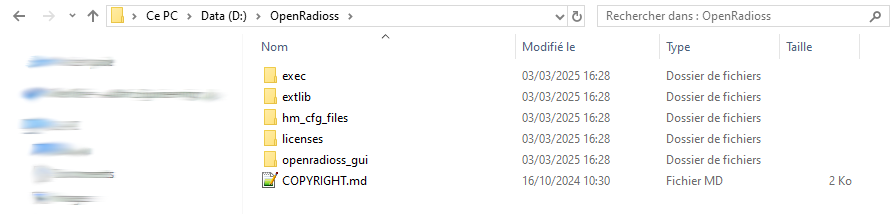

# Getting Started

This describes the easiest way to install OpenRadioss on your computer and launch a computation.

This will work on most Intel and AMD computers on Windows and Linux.

## Watch "Getting Started" video

Have a look at the [Getting Started video on Youtube](https://www.youtube.com/watch?v=_i-3GPSGxm4&t=11s)

## Steps

### Install Python 3

* On Windows Python can be found at : [python.org](https://www.python.org/)
* On Linux:
  * RL 8 or RL9:

        sudo dnf install python3

  * Ubuntu

        sudo apt-get install python3
        sudo apt-get install python-is-python3

### Download latest OpenRadioss stable build

[https://github.com/OpenRadioss/OpenRadioss/releases](https://github.com/OpenRadioss/OpenRadioss/releases)

Choose the binaries according to the operating system:

* Windows (_win64)
* Linux (_linux64)

### Download one example model

OpenRadioss example models can be found on [openRadioss.org/models](https://openradioss.org/models/)

One Tensile Test example in LS-DYNA format can be found here: [Tensile Test LS-Dyna format](https://openradioss.atlassian.net/wiki/download/attachments/21364914/zug_test3_RS.zip?api=v2)

### Unzip the packages in installation directory

#### OpenRadioss package

* Windows: preferred Zip tool
* Linux: unzip OpenRadioss_linux64.zip

#### Model package in Execution directory

#### Launch the OpenRadioss GUI

In OpenRadioss installation :

* On Windows : launch openradioss_gui/OpenRadioss_gui.vbs
* On Linux : launch openradioss_gui/OpenRadioss_gui.bash

#### Browse to directory folder and select input deck

* Apply selection with "Open"

#### Select "number of threads" and "Add Job"

* -nt field : Add 4 for 4 threads
* Select "Add Job"

#### Job is running!

