# How to Use Visual Studio Debugger with OpenRadioss 

## Pre-requisited

* This page assumes that Build environment with Git, Visual Studio, Intel OneAPI and the Intel OneAPI plugin for Visual Studio was properly installed.
* The procedure was tested on Visual Studio 2019 and Visual Studio 2022.

Check in [HOWTO.md](../HOWTO.md) section for the installation.

## Choose the Debug Configuration in the configuration Menus

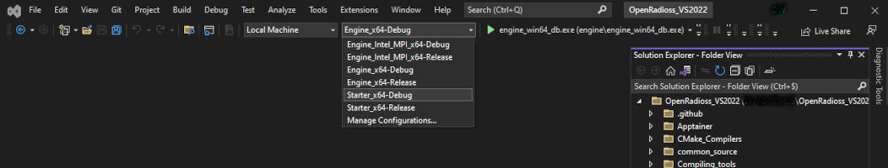 

## Build the Configuration

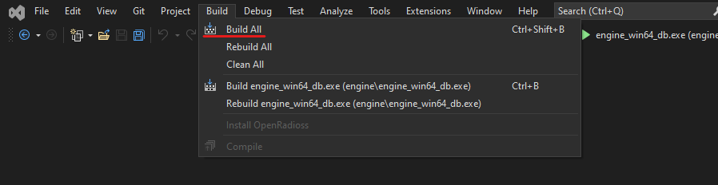

The Executables to use and symbol .pdb files are in the build directory

For the SMP directories:

* Starter 

      [OpenRadioss Root]\vs_build_win64\Starter_x64-Debug\starter

* Engine 

      [OpenRadioss Root]\vs_build_win64\Starter_x64-Debug\engine

## Add the directory to te pdb files in Debugging section from Options Menus

This needs to be done only once.
Options can be found in [Tools][Options]

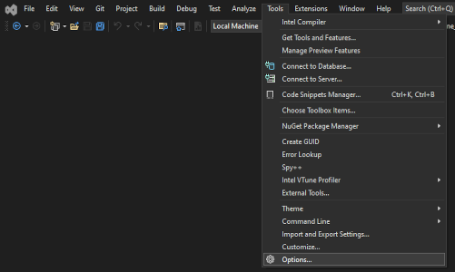

Search Debugging in the list & choose Symbols:

The Pdb symbol files can be found When Building the Debugging versions on:
* [OpenRadiossRoot]\vs_build_win64\Starter_x64-Debug\starter
* [OpenRadiossRoot]\vs_build_win64\Engine_x64-Debug\engine

You can add the .pdb files by clicking on the '+' icon.

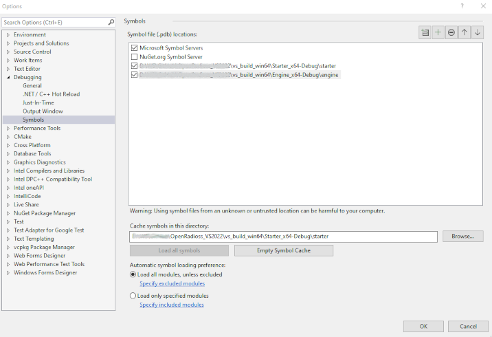

You can now add your settings to create the Debug session. 
Set the menus to execute the Model you need to Debug.

## To access the settings to debug, select first the default setting.
Select the default executable in "Startup Item Menu"
* starter_win64_db.exe for Starter.
* engine_win64_db.exe for Engine.

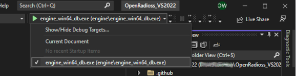

You can now add your settings to create the Debug session. 
Set the menus to execute the Model you need to Debug.

## Select the "Debug and launch Settings" to configure the Debug run

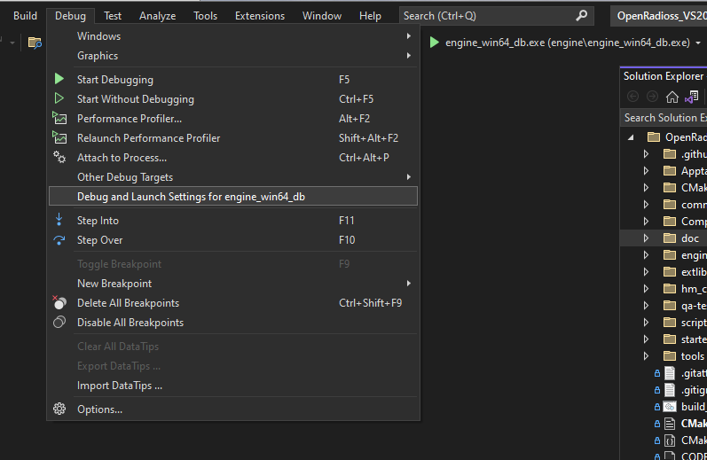

It is a Json file which can be modified. It contains the launch parameters and sets entries in the the "Launch Item" menu.

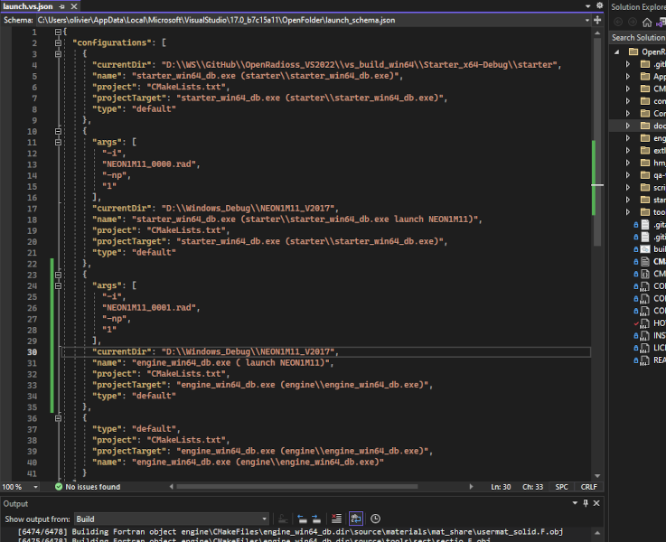

Add en Entry with :
* Input Deck directory: "currentDir" 
* execution arguments: "args"
* A title: "name"

This will permit to launch the OpenRadioss deck with debugger.

Here are templates for Starter & Engine : 

    {
      "args": [
        "-i",
        "DECK_0000.rad",
        "-np",
        "1"
      ],
      "currentDir": "[Path To Input Deck/Launch Directory]",
      "name": "starter_win64_db.exe (starter\\starter_win64_db.exe launch NEON1M11)",
      "project": "CMakeLists.txt",
      "projectTarget": "starter_win64_db.exe (starter\\starter_win64_db.exe)",
      "type": "default"
    },
    {
      "args": [
        "-i",
        "DECK_0001.rad"
      ],
      "currentDir": "[Path To Input Deck/Launch Directory]",
      "name": "engine_win64_db.exe ( launch NEON1M11)",
      "project": "CMakeLists.txt",
      "projectTarget": "engine_win64_db.exe (engine\\engine_win64_db.exe)",
      "type": "default"
    },

## To Debug, Breakpoints are mandatory.

Breakpoints can be set in source code on the left column.
On the Source where the Breakpoint should be placed, click on the left column on the line where the breakpount should be set. A red dot apprears.
The breakpoint is set.

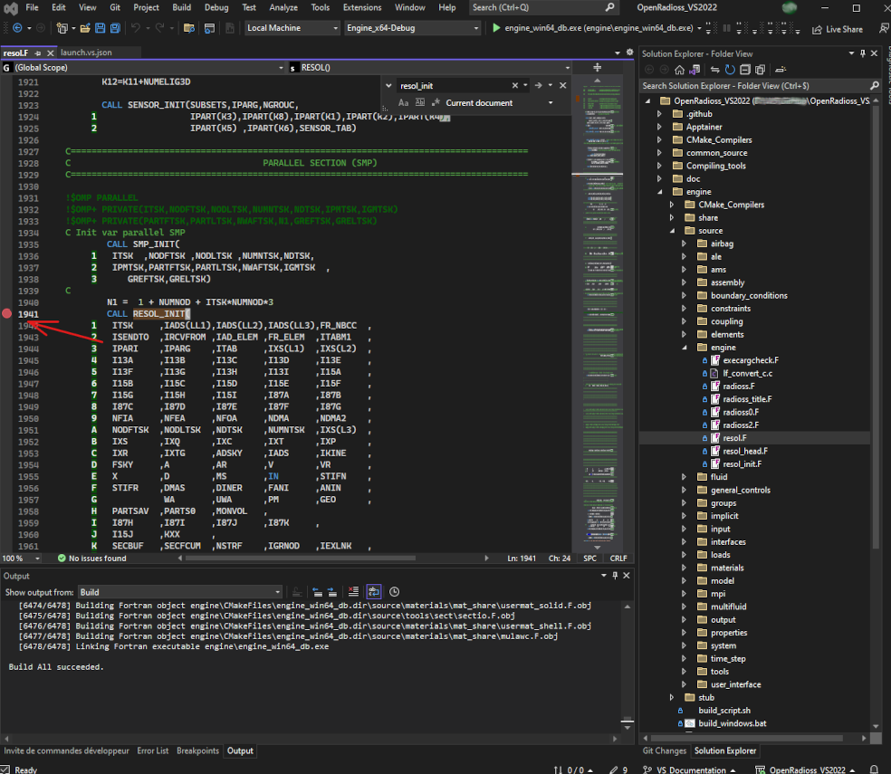

## Now, the debug session can be started : Select new created entry in Startup ITem Menu

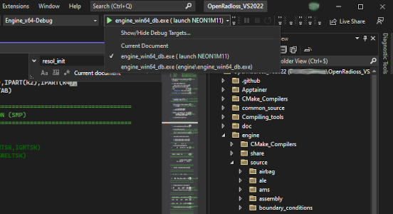

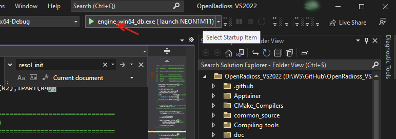

## The Job stopped at the Breakpoints.
The menus on top permits to continue.
highlight with the mouse on variables to highligh values etc...

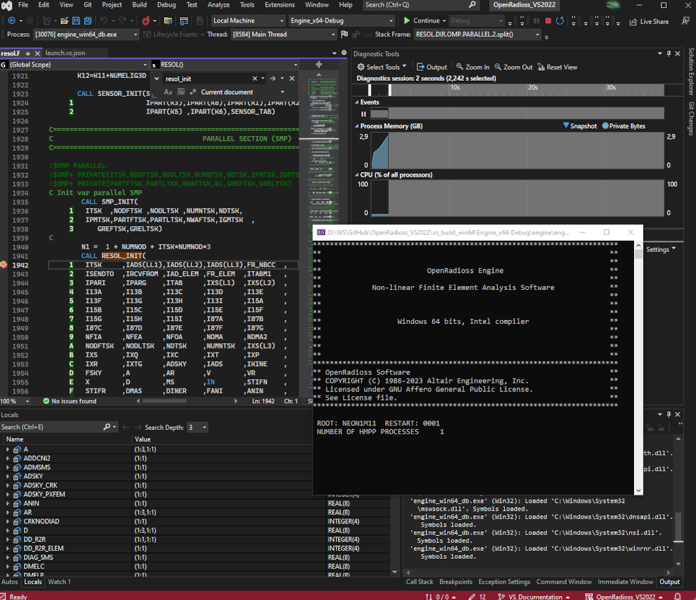

