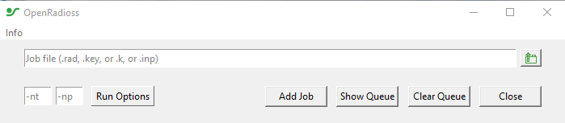
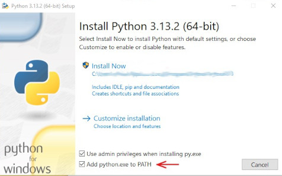

# OpenRadioss GUI

OpenRadioss GUI is a graphical launcher for OpenRadioss and Radioss.

It is distributed with the [OpenRadioss Stable releases](https://github.com/OpenRadioss/OpenRadioss/releases)

## How to use

* Python 3 + tk version 3.8 or higher must be installed on the machine.

  * On ***Windows***, install Python from [https://www.python.org/downloads/](https://www.python.org/downloads/)

    During Python installation: Make sure to select "Add python.exe to PATH"

    

  * On ***Linux***, install python from your OS Repository.

    * On RedHat, CentOS, Rocky Linux

          dnf install python3
          dnf install python3-tkinter

    * On Debian, Ubuntu

          apt-get install python3
          apt install python3-tk

* Download OpenRadioss stable release from [OpenRadioss Stable releases](https://github.com/OpenRadioss/OpenRadioss/releases)

* Unpack the package on your machine

* Enter OpenRadioss/openradioss_gui

* Execute

  * On Linux : ./OpenRadioss_gui.bash

  * On Windows : OpenRadioss_gui.vbs

## Access the source code

Visit [OpenRadioss/Tools/openradioss_gui](https://github.com/OpenRadioss/Tools/tree/main/openradioss_gui) repository.
